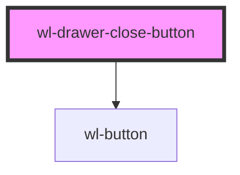

# wl-drawer-close-button

<!-- Auto Generated Below -->

## Properties

| Property      | Attribute  | Description | Type                                                                                                                         | Default     |
| ------------- | ---------- | ----------- | ---------------------------------------------------------------------------------------------------------------------------- | ----------- |
| `buttonProps` | --         |             | `undefined \| { [key: string]: HTMLWlButtonElement; }`                                                                       | `undefined` |
| `circular`    | `circular` |             | `boolean \| undefined`                                                                                                       | `undefined` |
| `color`       | `color`    |             | `"danger" \| "dark" \| "light" \| "medium" \| "primary" \| "secondary" \| "success" \| "tertiary" \| "warning" \| undefined` | `undefined` |
| `variant`     | `variant`  |             | `"block" \| "clear" \| "full" \| "outline" \| "solid" \| undefined`                                                          | `undefined` |

## Methods

### `close() => Promise<void>`

#### Returns

Type: `Promise<void>`

## Dependencies

### Depends on

- [wl-button](../wl-button)

### Graph

----------------------------------------------

*Built with [StencilJS](https://stenciljs.com/)*
