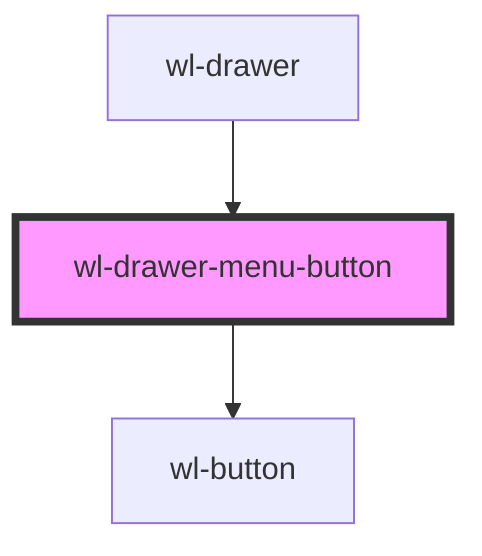

# wl-drawer-menu-button

<!-- Auto Generated Below -->

## Properties

| Property  | Attribute | Description | Type                                                                                                                         | Default     |
| --------- | --------- | ----------- | ---------------------------------------------------------------------------------------------------------------------------- | ----------- |
| `color`   | `color`   |             | `"danger" \| "dark" \| "light" \| "medium" \| "primary" \| "secondary" \| "success" \| "tertiary" \| "warning" \| undefined` | `undefined` |
| `size`    | `size`    |             | `"lg" \| "sm" \| "xl" \| undefined`                                                                                          | `undefined` |
| `variant` | `variant` |             | `"block" \| "clear" \| "full" \| "outline" \| "solid" \| undefined`                                                          | `"clear"`   |

## Dependencies

### Used by

 - [wl-drawer](../wl-drawer)

### Depends on

- [wl-button](../wl-button)

### Graph

----------------------------------------------

*Built with [StencilJS](https://stenciljs.com/)*
