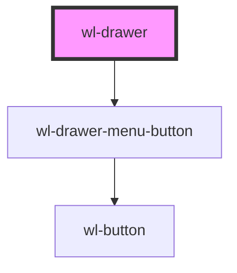

# wl-drawer

<!-- Auto Generated Below -->

## Properties

| Property    | Attribute   | Description | Type                                     | Default     |
| ----------- | ----------- | ----------- | ---------------------------------------- | ----------- |
| `disabled`  | `color`     |             | `boolean \| undefined`                   | `undefined` |
| `isOpen`    | `is-open`   |             | `boolean`                                | `false`     |
| `placement` | `placement` |             | `"bottom" \| "left" \| "right" \| "top"` | `"left"`    |

## Events

| Event                   | Description | Type                                |
| ----------------------- | ----------- | ----------------------------------- |
| `drawerOpenStateChange` |             | `CustomEvent<{ isOpen: boolean; }>` |

## Methods

### `close() => Promise<void>`

#### Returns

Type: `Promise<void>`

### `open() => Promise<void>`

#### Returns

Type: `Promise<void>`

## Dependencies

### Depends on

- [wl-drawer-menu-button](../wl-drawer-menu-button)

### Graph

----------------------------------------------

*Built with [StencilJS](https://stenciljs.com/)*
