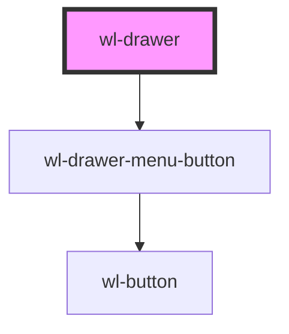

# wl-drawer

<!-- Auto Generated Below -->

## Properties

| Property    | Attribute   | Description | Type                                                                                                                         | Default   |
| ----------- | ----------- | ----------- | ---------------------------------------------------------------------------------------------------------------------------- | --------- |
| `color`     | `color`     |             | `"danger" \| "dark" \| "light" \| "medium" \| "primary" \| "secondary" \| "success" \| "tertiary" \| "warning" \| undefined` | `"light"` |
| `isOpen`    | `is-open`   |             | `boolean`                                                                                                                    | `false`   |
| `placement` | `placement` |             | `"bottom" \| "left" \| "right" \| "top"`                                                                                     | `"left"`  |

## Events

| Event    | Description | Type               |
| -------- | ----------- | ------------------ |
| `closed` |             | `CustomEvent<any>` |

## Methods

### `close() => Promise<void>`

#### Returns

Type: `Promise<void>`

### `onDrawerClosed() => Promise<void>`

#### Returns

Type: `Promise<void>`

### `open() => Promise<void>`

#### Returns

Type: `Promise<void>`

## Dependencies

### Depends on

- [wl-drawer-menu-button](../wl-drawer-menu-button)

### Graph

----------------------------------------------

*Built with [StencilJS](https://stenciljs.com/)*
