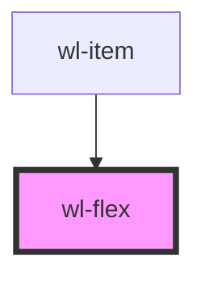

# wl-flex

<!-- Auto Generated Below -->

## Properties

| Property   | Attribute   | Description                                                                                                                                                                          | Type                                                                             | Default     |
| ---------- | ----------- | ------------------------------------------------------------------------------------------------------------------------------------------------------------------------------------ | -------------------------------------------------------------------------------- | ----------- |
| `align`    | `align`     |                                                                                                                                                                                      | `"baseline" \| "center" \| "end" \| "start" \| "stretch" \| undefined`           | `"stretch"` |
| `justify`  | `justify`   |                                                                                                                                                                                      | `"around" \| "between" \| "center" \| "end" \| "evenly" \| "start" \| undefined` | `"between"` |
| `offset`   | `offset`    | The amount to offset the column, in terms of how many columns it should shift to the end of the total available.                                                                     | `string \| undefined`                                                            | `undefined` |
| `offsetLg` | `offset-lg` | The amount to offset the column for lg screens, in terms of how many columns it should shift to the end of the total available.                                                      | `string \| undefined`                                                            | `undefined` |
| `offsetMd` | `offset-md` | The amount to offset the column for md screens, in terms of how many columns it should shift to the end of the total available.                                                      | `string \| undefined`                                                            | `undefined` |
| `offsetSm` | `offset-sm` | The amount to offset the column for sm screens, in terms of how many columns it should shift to the end of the total available.                                                      | `string \| undefined`                                                            | `undefined` |
| `offsetXl` | `offset-xl` | The amount to offset the column for xl screens, in terms of how many columns it should shift to the end of the total available.                                                      | `string \| undefined`                                                            | `undefined` |
| `offsetXs` | `offset-xs` | The amount to offset the column for xs screens, in terms of how many columns it should shift to the end of the total available.                                                      | `string \| undefined`                                                            | `undefined` |
| `pull`     | `pull`      | The amount to pull the column, in terms of how many columns it should shift to the start of the total available.                                                                     | `string \| undefined`                                                            | `undefined` |
| `pullLg`   | `pull-lg`   | The amount to pull the column for lg screens, in terms of how many columns it should shift to the start of the total available.                                                      | `string \| undefined`                                                            | `undefined` |
| `pullMd`   | `pull-md`   | The amount to pull the column for md screens, in terms of how many columns it should shift to the start of the total available.                                                      | `string \| undefined`                                                            | `undefined` |
| `pullSm`   | `pull-sm`   | The amount to pull the column for sm screens, in terms of how many columns it should shift to the start of the total available.                                                      | `string \| undefined`                                                            | `undefined` |
| `pullXl`   | `pull-xl`   | The amount to pull the column for xl screens, in terms of how many columns it should shift to the start of the total available.                                                      | `string \| undefined`                                                            | `undefined` |
| `pullXs`   | `pull-xs`   | The amount to pull the column for xs screens, in terms of how many columns it should shift to the start of the total available.                                                      | `string \| undefined`                                                            | `undefined` |
| `push`     | `push`      | The amount to push the column, in terms of how many columns it should shift to the end of the total available.                                                                       | `string \| undefined`                                                            | `undefined` |
| `pushLg`   | `push-lg`   | The amount to push the column for lg screens, in terms of how many columns it should shift to the end of the total available.                                                        | `string \| undefined`                                                            | `undefined` |
| `pushMd`   | `push-md`   | The amount to push the column for md screens, in terms of how many columns it should shift to the end of the total available.                                                        | `string \| undefined`                                                            | `undefined` |
| `pushSm`   | `push-sm`   | The amount to push the column for sm screens, in terms of how many columns it should shift to the end of the total available.                                                        | `string \| undefined`                                                            | `undefined` |
| `pushXl`   | `push-xl`   | The amount to push the column for xl screens, in terms of how many columns it should shift to the end of the total available.                                                        | `string \| undefined`                                                            | `undefined` |
| `pushXs`   | `push-xs`   | The amount to push the column for xs screens, in terms of how many columns it should shift to the end of the total available.                                                        | `string \| undefined`                                                            | `undefined` |
| `size`     | `size`      | The size of the column, in terms of how many columns it should take up out of the total available. If `"auto"` is passed, the column will be the size of its content.                | `string \| undefined`                                                            | `undefined` |
| `sizeLg`   | `size-lg`   | The size of the column for lg screens, in terms of how many columns it should take up out of the total available. If `"auto"` is passed, the column will be the size of its content. | `string \| undefined`                                                            | `undefined` |
| `sizeMd`   | `size-md`   | The size of the column for md screens, in terms of how many columns it should take up out of the total available. If `"auto"` is passed, the column will be the size of its content. | `string \| undefined`                                                            | `undefined` |
| `sizeSm`   | `size-sm`   | The size of the column for sm screens, in terms of how many columns it should take up out of the total available. If `"auto"` is passed, the column will be the size of its content. | `string \| undefined`                                                            | `undefined` |
| `sizeXl`   | `size-xl`   | The size of the column for xl screens, in terms of how many columns it should take up out of the total available. If `"auto"` is passed, the column will be the size of its content. | `string \| undefined`                                                            | `undefined` |
| `sizeXs`   | `size-xs`   | The size of the column for xs screens, in terms of how many columns it should take up out of the total available. If `"auto"` is passed, the column will be the size of its content. | `string \| undefined`                                                            | `undefined` |
| `wrap`     | `wrap`      |                                                                                                                                                                                      | `"nowrap" \| "wrap" \| "wrap-reverse" \| undefined`                              | `"wrap"`    |

## Dependencies

### Used by

 - [wl-item](../wl-item)

### Graph

----------------------------------------------

*Built with [StencilJS](https://stenciljs.com/)*
